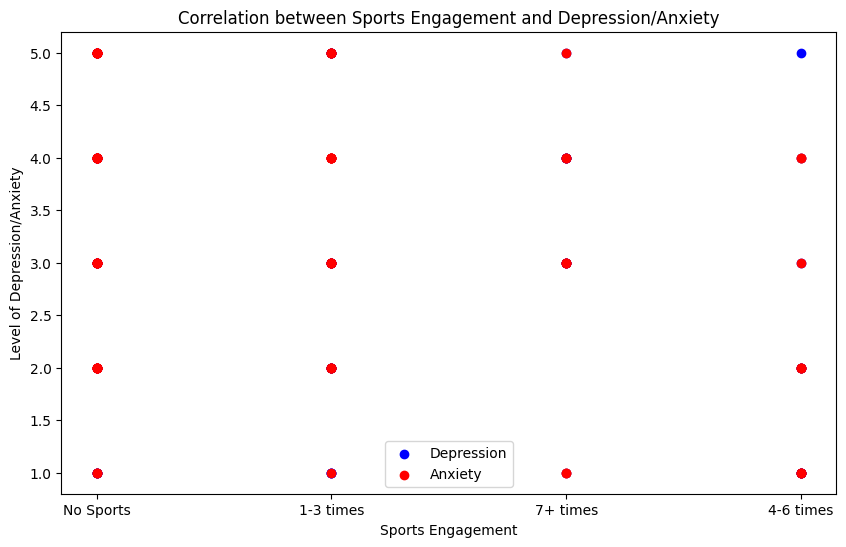
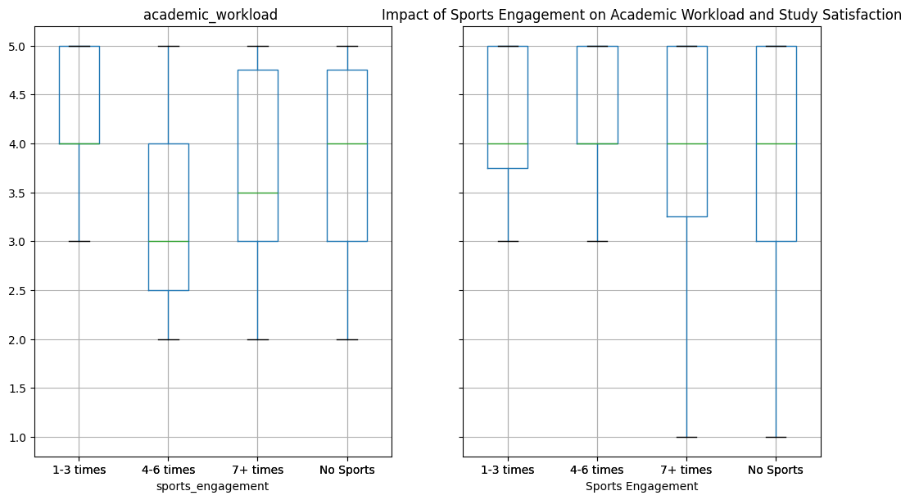
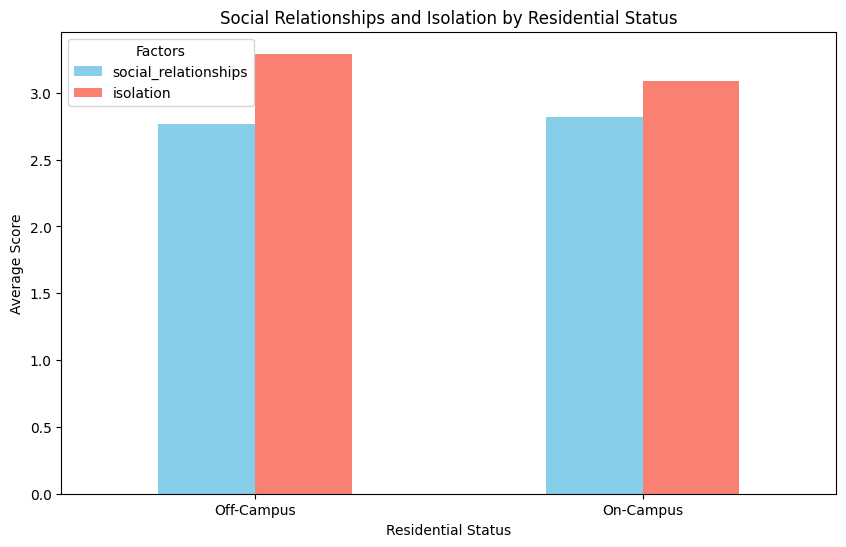
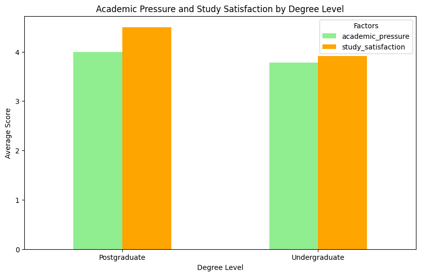
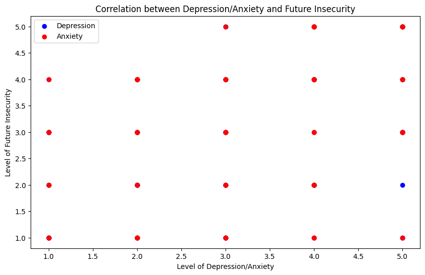
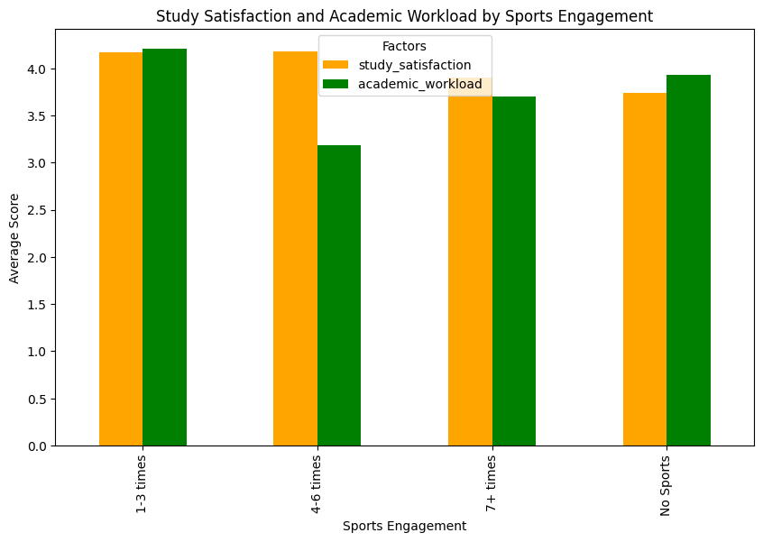
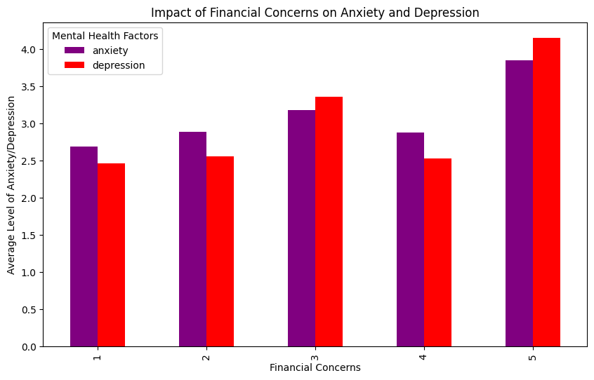
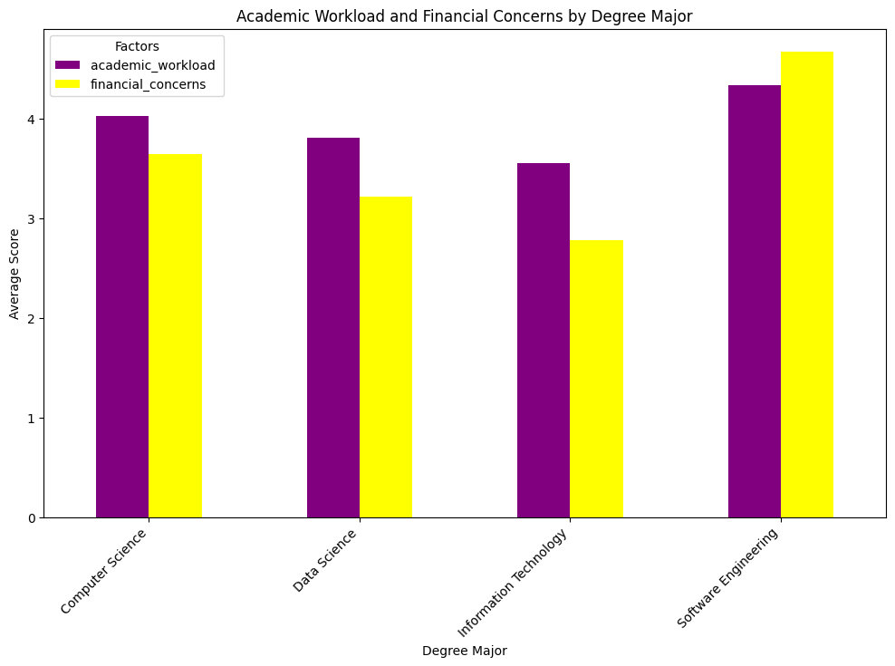
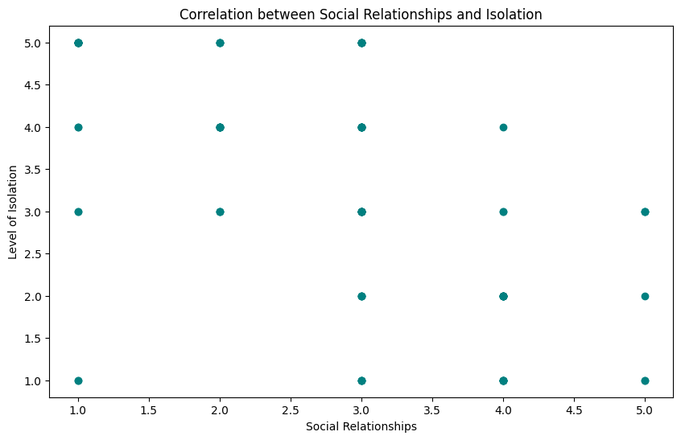

# async-blue-Zakiya-Mahoney-final-project

## Dataset
[Student Mental Health Survey](https://www.kaggle.com/datasets/abdullahashfaqvirk/student-mental-health-survey?resource=download)

## Why did I chose this dataset?

I chose this dataset because, as a former student-athlete, I have firsthand experience with the challenges of balancing academic responsibilities, physical health, and mental well-being. During my time as an athlete, I struggled with an injury that made it difficult to keep up with schoolwork, maintain a proper sleep schedule, and commit to rehabilitation due to time constraints. This experience made me realize how critical mental health is. When your mind is not in a good place, it can negatively impact your body and overall well-being. I want to explore how various factors such as academic pressure, social relationships, and physical activity, influence mental health in students and how these insights can help create a more supportive environment for those facing similar challenges.

## Progress
- [X] Picked dataset
- [X] Defined 10 questions
- [ ] Answered 10 questions using Pandas
- [ ] Added at least one data visualization (using Matplotlib and/or Seaborn) to each single question
- [ ] Prepared presentation slides to present at graduation

## Questions
- [ ] Question 1: How does involvement in sports correlate with levels of depression and anxiety among students?
  - Answer: 

sports_engagement   |     depression  | anxiety               

1-3 times            3.041667  3.416667

4-6 times            2.090909  2.090909

7+ times             3.400000  3.100000

No Sports            3.571429  3.428571

  - Visualization: 

- [ ] Question 2: Does participation in sports activities affect students' academic workload and study satisfaction?
  - Answer:                    

sports_engagement     |     academic_workload |  study_satisfaction                           

1-3 times                    4.208333            4.166667

4-6 times                    3.181818            4.181818

7+ times                     3.700000            3.900000

No Sports                    3.928571            3.738095

  - Visualization: 

- [ ] Question 3: How does involvement in extracurricular activities, like sports, affect students' engagement and participation in academic classes?
  - Answer:                    

residential_status     |     social_relationships | isolation                     

Off-Campus                      2.769231   3.292308

On-Campus                       2.818182   3.090909

  - Visualization: 

- [ ] Question 4:  What is the relationship between participation in sports and perceived stress levels among students?
  - Answer:

degree_level |     academic_pressure | study_satisfaction                            

Postgraduate            4.000000            4.500000

Undergraduate           3.776471            3.917647

  - Visualization: 

- [ ] Question 5: Do students with higher levels of depression and anxiety report greater feelings of future insecurity?
  - Answer:

  
depression  | anxiety | future_insecurity

depression           1.000000  0.844141           0.465185

anxiety              0.844141  1.000000           0.444924

future_insecurity    0.465185  0.444924           1.000000

  - Visualization: 

- [ ] Question 6: How do time constraints, such as those faced by student-athletes, affect study satisfaction and academic workload?
  - Answer:
     
sports_engagement    |    study_satisfaction | academic_workload                             

1-3 times                    4.166667            4.208333

4-6 times                    4.181818            3.181818

7+ times                     3.900000            3.700000

No Sports                    3.738095            3.928571

  - Visualization: 

- [ ] Question 7: How do financial concerns impact the mental health of students, particularly in terms of anxiety and depression?
  - Answer: 

financial_concerns | depression |  anxiety

financial_concerns            1.000000    0.379851  0.278741

depression                    0.379851    1.000000  0.844141

anxiety                       0.278741    0.844141  1.000000

  - Visualization: 

- [ ] Question 8: How does living on-campus versus off-campus impact students' access to academic resources and support services?
  - Answer:
     
degree_major     |   academic_workload |  financial_concerns                                      

Computer Science                  4.029412            3.647059

Data Science                      3.804878            3.219512

Information Technology            3.555556            2.777778

Software Engineering              4.333333            4.666667

  - Visualization: 

- [ ] Question 9: How do social relationships correlate with feelings of isolation among students?
  - Answer:

social_relationships |  isolation

social_relationships              1.000000  -0.558803

isolation                        -0.558803   1.000000

  - Visualization: 

- [ ] Question 10: Which stress relief activities are most effective in reducing depression and anxiety among students?
  - Answer: [Placeholder for answer]
  - Visualization: 
